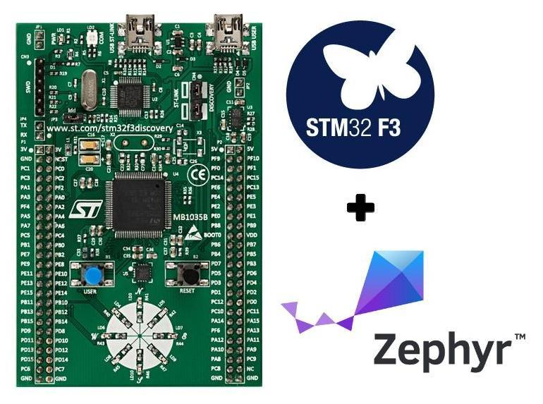

# Zephyr OS : Button Input Project - with Polling

This is introductory project showing the **Device Tree** mechanisms of 
[**Zephyr OS**](https://www.zephyrproject.org/). This project details
on how `GPIO resources` are mapped using **Device Tree**. It also
provides a functional example of `reading GPIO's`.

We are using the [STM32F3 Discovery](https://www.st.com/en/evaluation-tools/stm32f3discovery.html) board as a target for this project.

[](https://boseji.com/posts/zephyr-part-3-app-dev)

## Scripts

This project uses the latest version of *initialization* and *build* scripts.

The process of what's done in the script is [explained in the following article](https://www.boseji.com/posts/zephyr-part-3-app-dev/).

### Initialization Script

```shell
cd Workspace/${ProjectDirectory}
...
./init-project
```

This would create the `build_${ProjectDirectory}` directory with Make initialized.

**Note:** By default the **[STM32F3 Discovery](https://www.boseji.com/posts/zephyr-part-3-app-dev/#1-closer-look-at-stm32f3-discovery)** Board is selected.
One can provide additional input to change that.

```shell
cd Workspace/${ProjectDirectory}
...
./init-project arduino_zero
```

The above would change the Build to `arduino_zero`

### Build and Flash Script

```shell
cd Workspace/${ProjectDirectory}
...
./build-flash
```

This would use the `build_${ProjectDirectory}` created in the ***Initialization** step.

**Note:** By default the **[STM32F3 Discovery](https://www.boseji.com/posts/zephyr-part-3-app-dev/#1-closer-look-at-stm32f3-discovery)** Board is selected.

> *Currently there is no way to change this, but we are working on that.*

## Further Reading

There is a complete set of tutorials to help you get started on **Zephyr OS** :

- Installing the **Zephyr SDK** <br>
  <https://boseji.com/posts/zephyr-part-1-start/>
- Your first project to `blinky` example on **Zephyr OS**<br>
  <https://boseji.com/posts/zephyr-part-2-blinky-example-stm32f3discovery/>
- Application Development on **Zephyr OS** - creating the `fancier-blinky` <br>
  <https://boseji.com/posts/zephyr-part-3-app-dev>

## License

Copyright (c) 2020 Abhijit Bose <https://boseji.com>

SPDX-License-Identifier: Apache-2.0

All the files in this repository conform to
[Apache License, Version 2.0](http://www.apache.org/licenses/LICENSE-2.0)
unless otherwise specified.